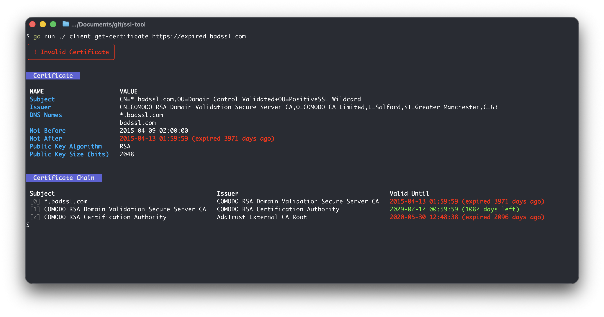

# ssl-tool

A CLI tool to inspect and retrieve SSL/TLS certificates.



## Installation

```sh
go install github.com/swisscom/ssl-tool@latest
```

## Usage

```
ssl-tool [command] [-l log-level]

Commands:
  cert    Certificate operations
  client  Client operations

Flags:
  -l, --log-level string   log level (debug, info, warning, error) (default "warning")
  -v, --version            version for ssl-tool
  -h, --help               help for ssl-tool
```

### `ssl-tool client get-certificate <url>`

Fetch and display the certificate chain from a live HTTPS endpoint.

```sh
ssl-tool client get-certificate https://expired.badssl.com
```

- Displays the leaf certificate details (subject, issuer, DNS names, validity, key info)
- Displays the full certificate chain with subject, issuer, and color-coded expiry
- Shows a warning banner for invalid/untrusted certificates
- Expiry dates are color-coded: **green** (valid), **yellow** (< 30 days), **red** (expired)

### `ssl-tool cert parse <certfile>`

Parse and display a local PEM certificate file (single cert or chain).

```sh
ssl-tool cert parse cert.pem
```
